# Dev Diary #53: The Military of Japan

Kon'nichiwa! Hello and welcome to a long time no see, Millennium Dawn Dev Diary. I (TheGeneral) will guide you through some of the ideas of the new Japanese content for the upcoming DLC. One of the key parts of the rework of Japan is the design of Article 9. For those who don’t know, Article 9 is a article in the constitution of Japan where the military is only allowed to act on self-defense. This has been part of the Japanese constitution since the end of world war 2. Article 9 is still active untill this day, but it had some new interpretations. This would ease the use off the Japanese Military.

Keep in mind that all of this is still a work in progress, and things are acceptable to change.Especially GFX.

### Starting Situation

We want to reflect that in the new Japanese content, but also give the player a way to remove it faster then real life. To do this we have designed a Balance of Power (BoP) of the Article 9.
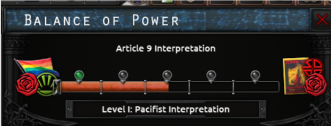
On the left you have strict pacificsm (the start value) and on the right you will have the highest interpretation level. We have hijacked the BoP to have it more like a progress meter. So your goal should be to have the bar as fast as possible to the right. Why you wonder? Well this is your starting modifier:
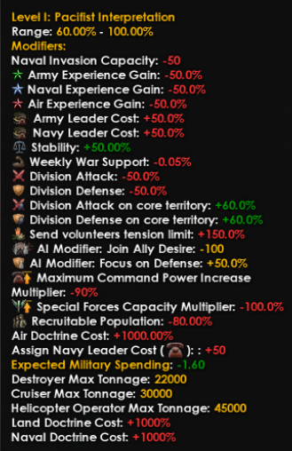
As you can see, you really don’t want that! Plus side is you have get a high stability modifier and your units will be very good in defending and attacking on core territory (reflecting the self-defense).
As Japan, you will have possibilities to increase your interpretation level but other countries might impact it aswell.
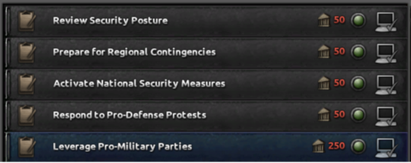
These decisions are available to you as Japan, where you have the power as the player to work to activate these. 3 of these decisions are locked behind world tension. But the other two are based on your political situation:
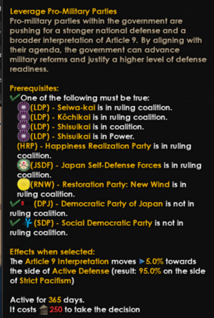
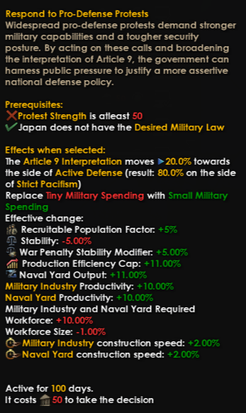
The most other decisions you have in power is the aggression of China. If China is increasing its Chinese Agression, you will unlock more decisions to raise your interpretation level.
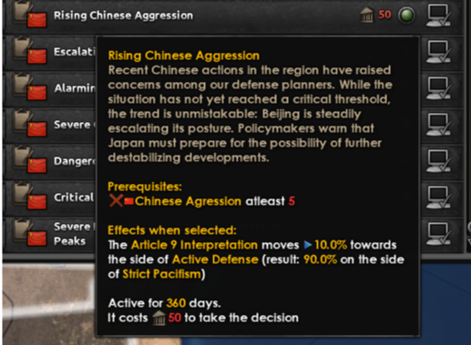
Also the choices North-Korea and Russia are making, will give you ways to change the BoP:
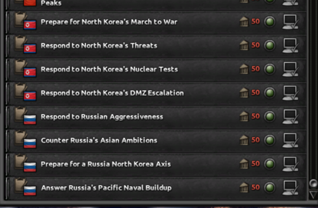
In the political tree we also will have focusses which will help you, in combating Article 9. Maybe even your USA friend can help (Donald Trump WILL push this button):
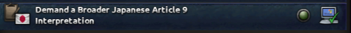

### Military Tree Pre-Article9
Now don’t worry. As Japan you still are able to work on your army.
With Article 9. You have access to these focusses:
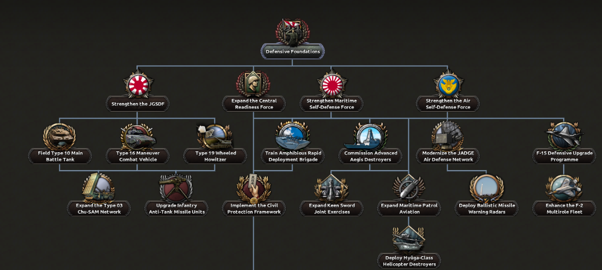
These will help improve your equipment and defense capabilities mostly. Your goal is to get to the ‘Establish the Defense Transition Committee’’ as fast as possible. This will help you get rid of the BoP:
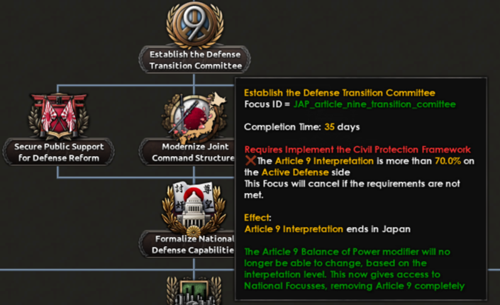
These will unlock missions which autocompletes to improve your article 9. This reflects that a constitution change just can’t be done in 70 days and your whole military is ready to fight in the world.
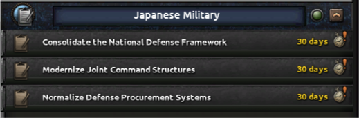
Once the negative penalties are gone. Its time for Japan to abandon Article 9 and become a new military power in Asia
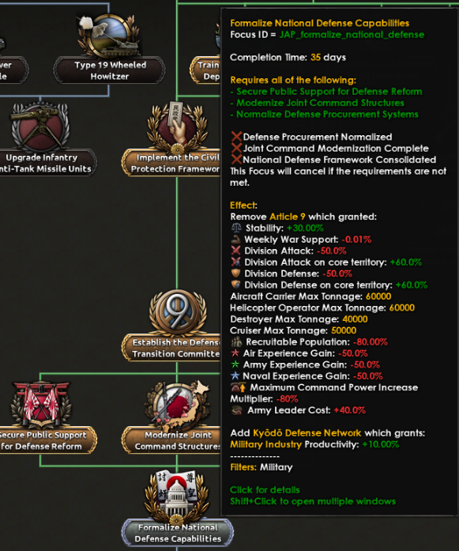

### Military Tree Post-Article9
When you complete the Formalize National Defense Capabilities, you unlock the full potential of the Japanese Military Focus Tree. To compensate for your struggle, the bonuses you gain will be a bit stronger then you would expect normally..
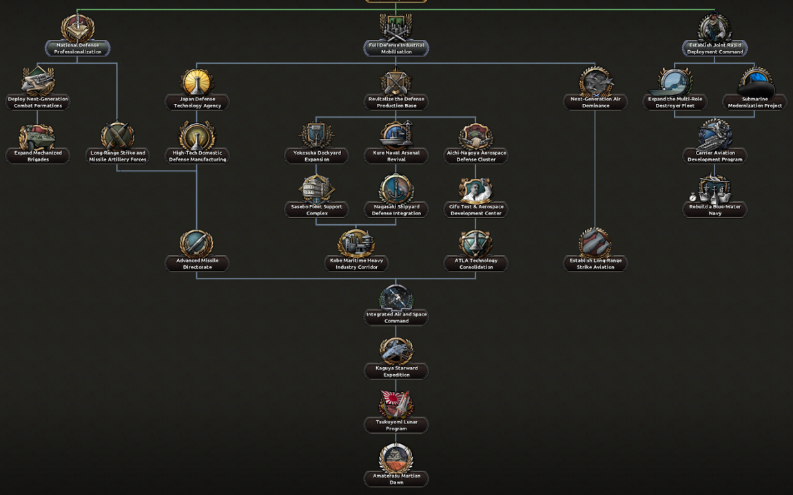
When you have completed the Japanese Military Branch. You have a very solid military at your disposale and even Japan gets into space (sorry Poland).
Remember your Article 9 modifier? Well at the end it becomes like this:
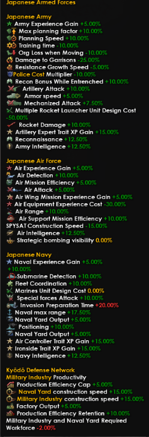
As you can see. Those rewards are powerful. Also via decisions and space focusses you unlock other bonuses which will help taking back the tide and not being a sitting duck.

And with that, that’s all for now. I have shared our plan to the Military of Japan, but now it’s your turn to tell us what you think, and we’re looking forward to hearing your feedback. Matane!

## External References

- Original draft: [Google Doc](https://docs.google.com/document/d/1IAIoNI2AcQlCZtUDHMpOGxMbft_tTJWPZkdsy6MHz9g/edit?usp=sharing)
